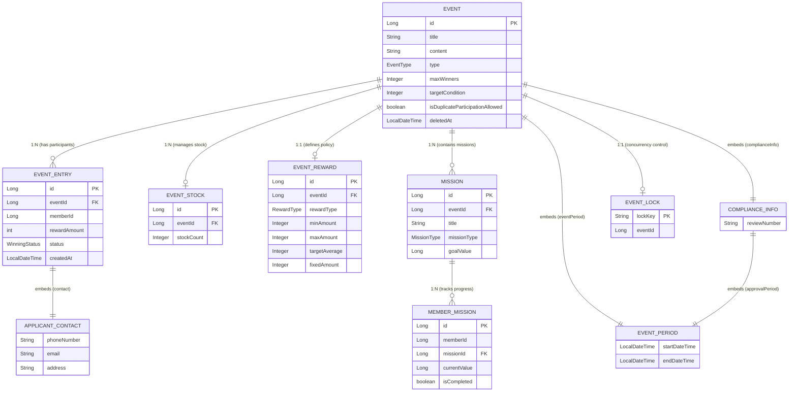

# 🚀 High-Traffic Event System

대규모 트래픽 상황에서도 안정적으로 동작하는 **선착순 및 추첨 이벤트 처리 시스템**입니다.  
Redis를 활용한 유량 제어, Kafka를 이용한 비동기 처리, 그리고 DB의 원자적 연산을 결합하여 데이터 정합성과 시스템 안정성을 동시에 확보했습니다.

---

## 🛠 Tech Stack

- **Core**: Java 17, Spring Boot 3.x
- **Persistence**: Spring Data JPA, MySQL (H2 for Test)
- **Caching & Concurrency**: Redis (String, ZSet, Atomic Operations)
- **Messaging**: Apache Kafka
- **Testing**: JUnit 5, Mockito, **Custom FakeRedis** (for Integration Test)

---

## 💡 Key Features

### 1. 동시성 제어 및 대용량 트래픽 처리
- **Redis Rate Limiter**: `EventApplyService` 앞단에서 Redis를 이용해 초당 요청 수(TPS)를 제한하여 DB 부하를 방지합니다.
- **Kafka 비동기 버퍼링**:
  - **High Traffic Mode**: 관리자가 Redis 플래그(`event:policy:high-traffic:{id}`)를 켜면, 즉시 DB에 저장하지 않고 Kafka로 이벤트를 발행하여 처리량을 조절합니다.
  - **선착순 이벤트**: 재고 확인 후 Kafka로 메시지를 발행, Consumer가 순차적으로 재고 차감 및 당첨 처리를 수행합니다.

### 2. 데이터 정합성 보장 (Stock Management)
- **Atomic DB Update**: `EventStockRepository`에서 `UPDATE ... SET count = count - 1 WHERE ...` 쿼리를 사용하여, 별도의 비관적 락(Pessimistic Lock) 없이도 DB 레벨의 원자성을 보장합니다.

### 3. 동적 보상 알고리즘 (Feedback Loop)
- **목표 평균 금액 유지**: `EventResultService`에서 Redis에 누적된 지급 총액과 횟수를 실시간으로 조회합니다.
- **알고리즘**: 현재 평균 지급액이 목표치보다 높으면 평균보다 낮은 금액 구간에서, 낮으면 높은 금액 구간에서 랜덤 추첨하여 최종적으로 목표 평균(예: 50P)에 수렴하도록 합니다.

### 4. 도메인 주도 설계 (DDD)
- **Value Objects**: `EventPeriod`, `ComplianceInfo` 등을 VO로 분리하여 기간 유효성 검증 로직을 도메인 객체 내부에 캡슐화했습니다.
- **Aggregate**: `Event` 엔티티가 `EventStock`, `EventReward` 등의 생명주기를 관리하는 루트 역할을 수행합니다.

### 5. 컴플라이언스 대응
- **준법리스크**: `ComplianceInfo(준법심의필)` 등의 명시화
- **개인정보보호**: `EventService.deleteEvent` 의 이벤트 삭제 시 개인정보 파기 처리
---

## 🏗 Architecture Flow

### 선착순 이벤트 (First-Come-First-Served)
1. **User Request** -> **Redis Rate Limiter** (유량 제어)
2. **App**: DB 재고 조회 (단순 조회, `stock > 0`)
3. **App**: Kafka `event-apply-topic` 발행 (비동기 응답)
4. **Consumer**: 
   - DB Atomic Decrease (`UPDATE event_stock ...`)
   - 성공 시 보상 계산 및 `EventEntry` 저장

### 추첨 이벤트 (Raffle)
1. **User Request** -> **Redis High-Traffic Flag Check**
2. **Flag ON**: Kafka `event-raffle-topic` 발행 -> Consumer가 `PENDING` 상태로 저장 (추후 배치로 당첨자 선정)
3. **Flag OFF**: 즉시 DB 저장 (`PENDING`)

---

## 📊 Domain Model (ERD)



---

## 🧪 Testing Strategy

### FakeRedisConfig (Test Isolation)
본 프로젝트는 `Embedded Redis`의 아키텍처 종속성 문제를 해결하고, 테스트 속도를 높이기 위해 **Map 기반의 FakeRedis**를 구현하여 사용합니다.

- **구현체**: `ConcurrentHashMap`을 사용하여 Redis의 Key-Value 저장소를 모사했습니다.
- **지원 기능**:
  - `opsForValue().set/get`: 기본 데이터 저장/조회
  - `increment`: `AtomicLong`과 유사한 원자적 증가 연산 지원
  - `expire`: `CompletableFuture`를 이용한 비동기 만료 시뮬레이션
  - `opsForZSet()`: 랭킹 테스트를 위한 Mock 지원

### 주요 테스트 시나리오
- **EventIntegrityTest**: 이벤트 삭제 시 개인정보 파기(Soft Delete) 및 데이터 무결성 검증.
- **KafkaRealServerReliabilityTest**: 실제 Kafka 브로커 연동 시 Consumer 장애 복구 및 데이터 유실 방지 테스트.
- **KafkaEmbeddedLogicTest**: Embedded Kafka를 활용한 선착순 이벤트의 비동기 메시지 발행 및 소비 로직 검증.
- **EventBatchTest**: 대량 데이터 기반의 추첨(Random/FCFS) 배치 로직 및 동시성 제어(Named Lock) 검증.
- **RedisTest**: Redis 기반의 유량 제어, 실시간 랭킹, 피드백 루프 보상 알고리즘 및 장애 Fallback 검증 (Embedded Redis).
- **RedisTest_FakeRedis**: FakeRedis를 활용하여 RedisTest와 동일한 테스트 수행.
- **MissionEventTest**: 미션 달성(걸음 수 등) 후 이벤트 응모로 이어지는 전체 비즈니스 흐름 통합 테스트.

### 이외 JUnit 테스트의 단위테스트 또한 수행
---

## 🚀 Getting Started

### Prerequisites
- Java 17+
- Docker (for local Redis/Kafka)
- Docker Compose (예시)

### 1. Infrastructure Setup (Local)
로컬 환경에서 애플리케이션을 실행하기 위해 필요한 인프라(MySQL, Redis, Kafka)를 Docker Compose로 구동합니다.

**docker-compose.yml**
```yaml
version: '3'
services:
  mysql:
    image: mysql:8.0
    environment:
      MYSQL_DATABASE: event_system
      MYSQL_ROOT_PASSWORD: root
    ports:
      - "3306:3306"
  redis:
    image: redis:alpine
    ports:
      - "6379:6379"
  zookeeper:
    image: confluentinc/cp-zookeeper:7.0.1
    environment:
      ZOOKEEPER_CLIENT_PORT: 2181
  kafka:
    image: confluentinc/cp-kafka:7.0.1
    depends_on:
      - zookeeper
    ports:
      - "9092:9092"
    environment:
      KAFKA_ZOOKEEPER_CONNECT: zookeeper:2181
      KAFKA_ADVERTISED_LISTENERS: PLAINTEXT://localhost:9092
      KAFKA_OFFSETS_TOPIC_REPLICATION_FACTOR: 1
```

```bash
docker-compose up -d
```

### 2. Run Application
```bash
./gradlew bootRun
```

### 3. Run Tests
```bash
./gradlew test
```
*`FakeRedisConfig`가 적용되어 있어 Embedded-Redis의 작동 오류에도 통합 테스트가 가능합니다.*
```